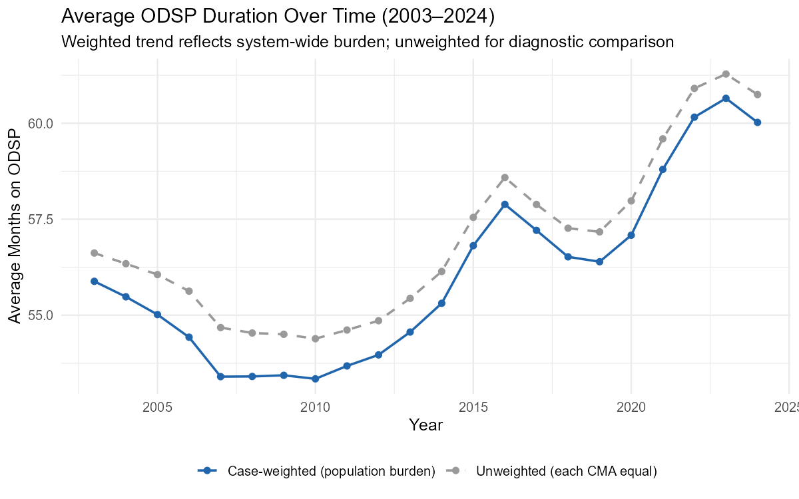
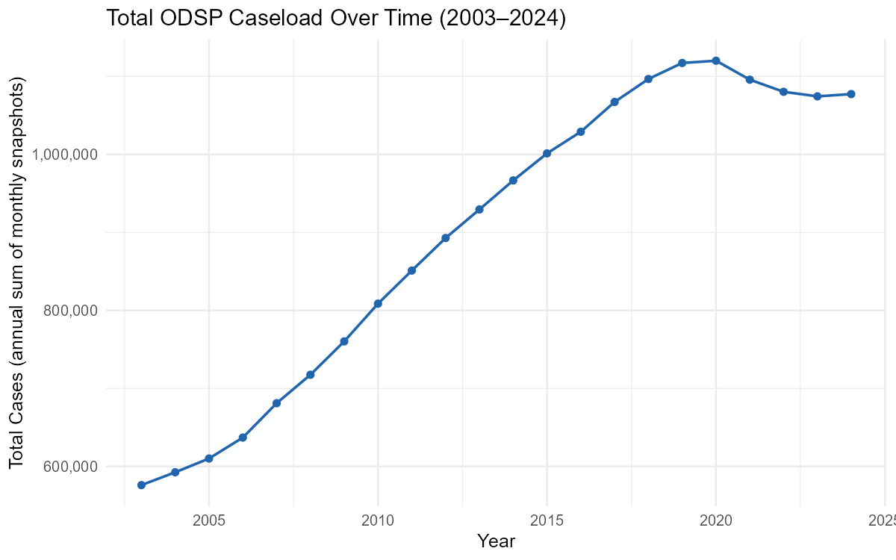
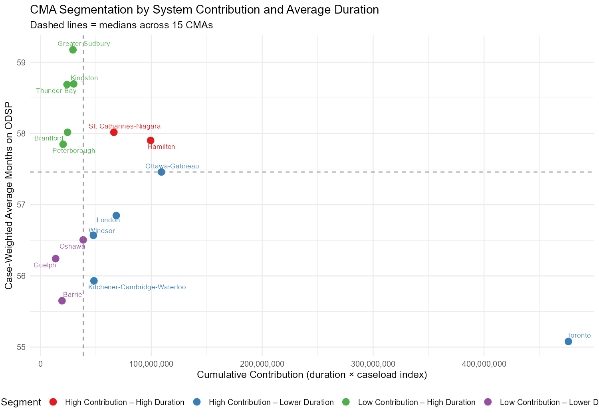
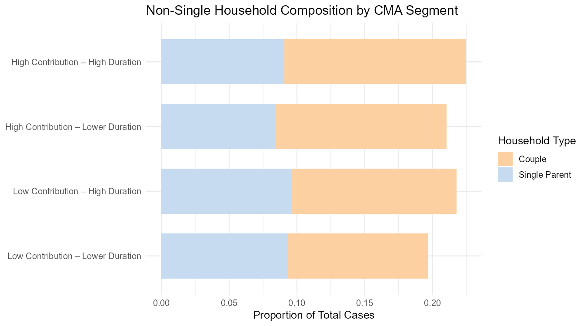
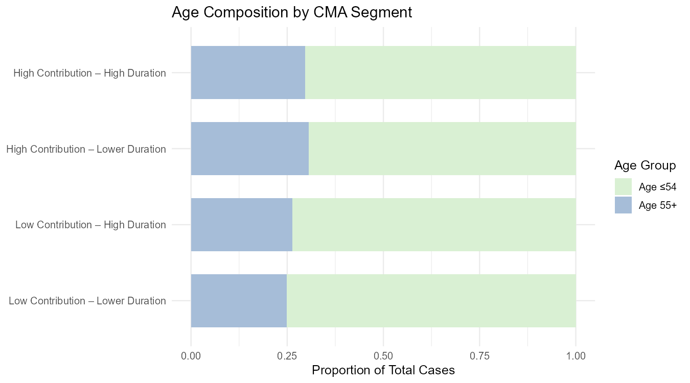
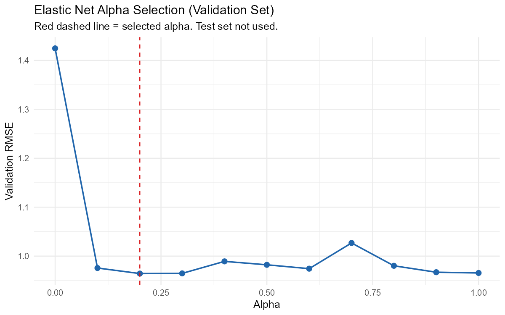
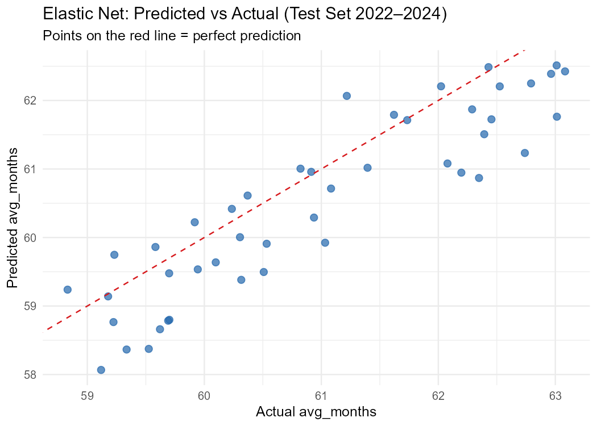
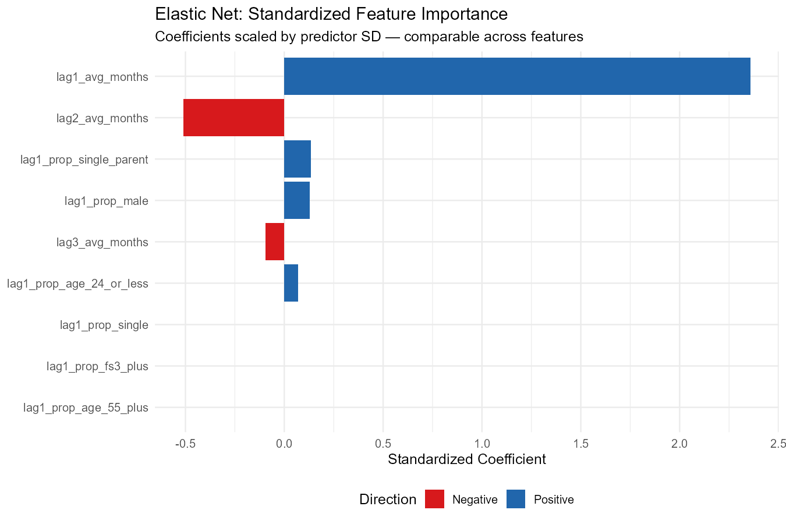
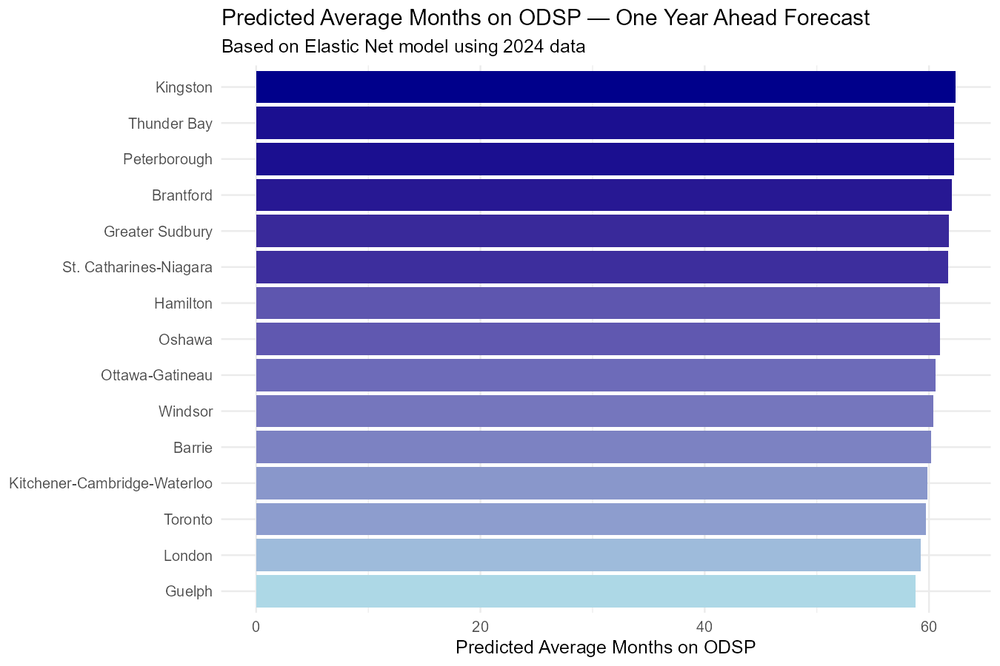

# Understanding Long-Term ODSP Reliance Across Ontario CMAs (2003–2024)
**A Policy-Focused Data Analysis & Forecasting Project | R**

---

## 📌 Purpose

The Ontario Disability Support Program (ODSP) provides income and employment support to Ontarians with long-term disabilities. System pressure is shaped not only by how many people receive assistance, but by how long they remain on it.

This project examines structural patterns of long-term ODSP reliance across Ontario's 15 Census Metropolitan Areas (CMAs) over two decades, using administrative data to identify which regions face the highest risk of sustained long-term dependency and what factors drive regional differences.

---

## 🎯 Key Policy Questions

1. How has average ODSP duration changed over time?
2. How has total caseload growth interacted with duration trends?
3. Which CMAs contribute most to long-term system pressure, and through what mechanisms?
4. Does demographic composition explain persistent regional differences?
5. Which CMAs face the highest predicted risk of sustained long-term reliance?

---

## 🗂️ Repository Structure

```
ODSP-Ontario-Analysis/
│
├── ODSP_Reliance_Across_Ontario.Rmd   # Full analysis — data prep, EDA, modeling
├── README.md
└── figures/                           # All plots referenced in this README
    ├── q1_duration_trend.png
    ├── q2_caseload_trend.png
    ├── q3_segmentation.png
    ├── q4_correlation_scatter.png
    ├── q4_household_composition.png
    ├── q4_age_composition.png
    ├── lm_residual_diagnostics.png
    ├── alpha_selection.png
    ├── predicted_vs_actual.png
    ├── feature_importance.png
    └── cma_risk_forecast.png

> Note: ODSP_CMA.csv is not included in this repository.
> Download the source data from the Government of Canada Open Data Portal
> and place it in the project root before running the Rmd file.
```

---

## 🛢️ Data

**Source:** Government of Canada – Open Data Portal  
**Coverage:** January 2003 – December 2024  
**Geography:** 15 Census Metropolitan Areas (CMAs) in Ontario  
**Unit of analysis:** CMA-year panel (aggregated from monthly administrative records)

Key variables:

- **Duration on ODSP** — grouped into short- (0–35 months), medium- (36–59 months), and long-term (60+ months) participation
- **Total caseload** — annual sum of monthly caseload snapshots
- **Household composition** — single adults, couples, single-parent households
- **Age group distribution** — ≤24, 25–54, 55+
- **Family size** — 1, 2, 3+ members
- **Gender composition** — male and female applicants

All analysis is conducted at the CMA level. No individual-level or identifiable data are used.

> **Note on avg_months:** Average duration is approximated using duration bucket midpoints (0–35 → 17.5 months, 36–59 → 47.5 months, 60+ → 72 months). A sensitivity analysis confirmed that CMA rankings are invariant to the choice of midpoint for the open-ended 60+ bucket across values of 72, 84, and 96 months, validating this assumption.

---

## 📊 Exploratory Analysis

### Q1 — Average ODSP Duration Has Increased Since 2015



Average ODSP duration declined between 2003 and 2009, stabilized through the early 2010s, and has increased steadily since 2015. The case-weighted trend consistently sits below the unweighted trend, confirming that larger-volume CMAs tend to have slightly shorter average durations than smaller CMAs. This is a structural signal — not a measurement artifact.

---

### Q2 — Caseload Growth Has Stabilized While Duration Continues Rising



Total caseload grew steadily from 2003 to 2020, nearly doubling over the period, before stabilizing. Crucially, average duration continued rising after 2020 even as caseload growth flattened. This divergence indicates that rising long-term reliance is increasingly driven by persistence among existing recipients rather than new entrants — a distinction with direct implications for policy design.

---

### Q3 — Regional System Pressure Is Driven by Different Mechanisms

CMAs were segmented using two dimensions: case-weighted average ODSP duration and a cumulative contribution index (average duration × annual caseload). Segmentation was assigned at the CMA level using median thresholds across all 15 CMAs.



> **Toronto note:** Toronto's cumulative contribution (~450M) is approximately 4× larger than the next highest CMA (Ottawa-Gatineau, ~109M). A robustness check using log-transformed contribution confirmed identical segment assignments under both specifications, indicating the segmentation is robust to Toronto's scale dominance. Raw contribution values are retained for interpretability.

**Segment 1 — High Contribution, High Duration** *(Hamilton, St. Catharines-Niagara)*  
Dual-pressure CMAs where both caseload scale and individual persistence exceed the provincial median. System pressure comes from two directions simultaneously. Long-term coordinated interventions addressing employment barriers, health complexity, and service integration are indicated.

**Segment 2 — High Contribution, Lower Duration** *(Toronto, Ottawa-Gatineau, London, Windsor, Kitchener-Cambridge-Waterloo)*  
Large system pressure driven primarily by caseload volume rather than duration. Individual recipients do not stay unusually long, but scale produces substantial provincial burden. Policy levers should focus on case management efficiency and timely transitions off assistance.

**Segment 3 — Low Contribution, High Duration** *(Greater Sudbury, Kingston, Thunder Bay, Brantford, Peterborough)*  
Persistently long durations despite smaller caseloads. These CMAs are underrepresented in aggregate provincial statistics but reflect serious structural disadvantage — smaller economies, fewer employment off-ramps, and limited service access. Equity considerations are significant.

**Segment 4 — Low Contribution, Lower Duration** *(Oshawa, Guelph, Barrie)*  
Comparative benchmarks with below-median duration and contribution. These CMAs warrant examination of what local conditions or service models produce more favourable outcomes.

---

### Q4 — Demographic Composition Explains Little; Structure Dominates

**CMA-level correlation analysis** (n = 15) between demographic proportions and average ODSP duration:

| Predictor | Correlation | Direction | Strength |
|---|---|---|---|
| prop_age_25_to_54 | 0.602 | Positive | Strong |
| prop_single_parent | 0.339 | Positive | Moderate |
| prop_male | 0.226 | Positive | Weak |
| prop_couple | 0.117 | Positive | Weak |
| prop_fs3_plus | 0.106 | Positive | Weak |
| prop_single | -0.266 | Negative | Weak |
| prop_fs1 | -0.266 | Negative | Weak |
| prop_age_55_plus | -0.270 | Negative | Weak |
| prop_age_24_or_less | -0.501 | Negative | Moderate |

Working-age composition (25–54) shows the strongest positive association with average duration (r = 0.60), indicating that CMAs with higher concentrations of prime working-age recipients tend to have longer average stays. Single-parent household share shows a moderate positive association (r = 0.34), reflecting compounding barriers of caregiving and labour market participation. Youth recipient share (≤24) shows a moderate negative association (r = -0.50), consistent with shorter spells among younger cohorts.

Segment-level demographic composition varies little across all four CMA segments, as shown below.



Single-adult households consistently represent ~78–80% of cases in every segment. Among non-single households, couples and single-parent families together account for less than one-quarter of cases with only modest variation across segments.



Working-age adults (≤54) comprise roughly 60–65% of cases across all segments. Older adults (55+) show slightly higher representation in high-duration segments, but the variation is modest. Overall, no segment displays a demographic profile distinct enough to explain its duration or contribution classification — confirming that regional differences in ODSP burden are primarily structural and path-dependent rather than demographically driven.

> **Note on interpretation:** The correlation table above reflects CMA-level analysis (n = 15) and is the correct basis for inference. The segment-level charts are descriptive summaries only — averaging across CMAs within segments compresses within-segment variation and should not be used to draw causal conclusions.

---

## 🔮 Modeling — Identifying CMAs at Risk of Sustained Long-Term Reliance

### Design Principles

Two key design choices distinguish this modeling approach from a naive implementation:

**1. Lagged demographic predictors.** All demographic features are lagged by one year. Using same-year demographics to predict same-year duration is not genuine forecasting — at prediction time, the current year's demographics are unknown. Lagged features reflect real forecasting conditions.

**2. Three-way train/validation/test split.**
- **Train:** 2006–2019
- **Validation:** 2020–2021 *(used only for hyperparameter selection)*
- **Test:** 2022–2024 *(held out entirely until final evaluation)*

This prevents data leakage in alpha selection — a flaw in the original specification where the test set was used to select hyperparameters, making reported test metrics optimistically biased.

> **Note on `prop_fs1`:** Family size 1 was found to be perfectly collinear with `prop_single` (Pearson r = 1.0), indicating both variables capture identical administrative classifications. `lag1_prop_fs1` was excluded from all models.

---

### Model 1 — Linear Regression (Baseline)

A baseline OLS model was estimated using one duration lag and lagged demographic predictors. Residual diagnostics were applied before interpreting results.

**Heteroscedasticity:** The Breusch-Pagan test detected non-constant residual variance (BP = 18.36, p = 0.010). HC3 robust standard errors were applied throughout.

**Autocorrelation:** The Durbin-Watson statistic (DW = 0.948) is well below 2, suggesting positive autocorrelation consistent with annual CMA-level panel data. The test p-value likely understates this due to limited panel depth (15 CMAs). Standard errors should be interpreted with caution.

**Significant predictors** (after robust standard errors):

| Predictor | Coefficient | Direction |
|---|---|---|
| lag1_avg_months | 0.934 | Positive *** |
| lag1_prop_age_24_or_less | 11.43 | Positive ** |
| lag1_prop_single_parent | 15.70 | Positive * |
| lag1_prop_male | 14.68 | Positive * |

Adjusted R² = 0.89. Prior-year duration is the dominant predictor, confirming strong path dependence.

---

### Model 2 — Ridge-Dominant Elastic Net (alpha = 0.2)

An Elastic Net model was estimated incorporating three duration lags and lagged demographic predictors. Alpha was selected via grid search on the validation set only — the test set was not used during hyperparameter selection.

**Alpha selection:** Grid search identified alpha = 0.2 as optimal (minimizing validation RMSE). This predominantly Ridge specification retains all informative predictors while controlling for multicollinearity among correlated lag terms, with a small Lasso component providing flexibility to eliminate uninformative predictors.



**`lambda.1se`** was used for final predictions — the most regularized model within one standard error of minimum CV error, preferred when generalization matters more than minimizing training error.

---

### Model Comparison

| Model | Train RMSE | Validation RMSE | Test RMSE |
|---|---|---|---|
| Linear Regression | 0.659 | 1.234 | 0.930 |
| Elastic Net (alpha = 0.2) | 0.574 | 1.240 | **0.728** |

The Elastic Net outperforms the linear baseline on the held-out test set (RMSE: 0.728 vs 0.930 — a 22% reduction). Both models show elevated validation RMSE (~1.24), consistent with COVID-19 pandemic disruption to ODSP dynamics in 2020–2021 — an extraordinary structural break not present in the training data. The near-identical validation performance across both models confirms this elevation reflects an external shock rather than model-specific overfitting. Test performance recovering to 0.728 confirms meaningful predictive signal under more stable post-pandemic conditions.



---

### Feature Importance (Standardized Coefficients)

Raw Elastic Net coefficients are not directly comparable across predictors with different scales. Standardized coefficients — raw coefficients multiplied by predictor standard deviation — are used to correctly assess relative predictor importance.



| Feature | Std. Coefficient | Direction |
|---|---|---|
| lag1_avg_months | 2.358 | Positive |
| lag2_avg_months | -0.511 | Negative |
| lag1_prop_single_parent | 0.135 | Positive |
| lag1_prop_male | 0.128 | Positive |
| lag3_avg_months | -0.095 | Negative |
| lag1_prop_age_24_or_less | 0.070 | Positive |
| lag1_prop_single | 0.000 | — (eliminated) |
| lag1_prop_age_55_plus | 0.000 | — (eliminated) |
| lag1_prop_fs3_plus | 0.000 | — (eliminated) |

**Historical duration dominates.** The one-year lag (std. coef = 2.358) is the strongest predictor by a wide margin, confirming strong path dependence. The negative coefficients on lag2 (-0.511) and lag3 (-0.095) introduce a partial mean-reversion dynamic — prolonged elevation in duration over multiple years is partially self-correcting. This finding was not detectable with a single-lag specification.

**Three predictors were eliminated** by the Lasso regularization component (`prop_single`, `prop_age_55_plus`, `prop_fs3_plus`), contributing no additional predictive signal given the retained features.

**Demographic composition plays a secondary role.** Single-parent household share and gender composition are the most informative retained demographic predictors, consistent with EDA correlation findings. This is consistent with the overall finding that ODSP duration is primarily structural and path-dependent rather than demographically driven.

---

### CMA Risk Forecast — One Year Ahead



| CMA | Predicted Avg Months |
|---|---|
| Kingston | 62.39 |
| Thunder Bay | 62.21 |
| Peterborough | 62.21 |
| Brantford | 62.07 |
| Greater Sudbury | 61.79 |
| St. Catharines-Niagara | 61.71 |
| Hamilton | 61.00 |
| Oshawa | 60.96 |
| Ottawa-Gatineau | 60.61 |
| Windsor | 60.42 |
| Barrie | 60.22 |
| Kitchener-Cambridge-Waterloo | 59.86 |
| Toronto | 59.75 |
| London | 59.24 |
| Guelph | 58.77 |

The top five ranked CMAs — Kingston, Thunder Bay, Peterborough, Brantford, and Greater Sudbury — all belong to the **Low Contribution – High Duration** segment identified in the EDA. This convergence between descriptive segmentation and model-based forecasting strengthens confidence in both findings.

Predicted values are tightly clustered within a range of less than four months across all 15 CMAs, indicating that elevated long-term reliance risk is a shared structural condition across multiple regions rather than an isolated problem.

Guelph and Barrie — the benchmark CMAs — rank lowest, consistent with their below-median historical duration profiles. Toronto and London rank near the bottom despite generating the largest absolute system pressure, reinforcing that their burden is volume-driven rather than persistence-driven.

> These forecasts are region-level risk signals reflecting historical persistence and demographic composition under prevailing structural conditions. They are not causal estimates and do not account for future policy changes, economic shocks, or program reforms.

---

## 🏁 Summary

Long-term ODSP reliance across Ontario CMAs is primarily **structural and path-dependent** rather than driven by demographic composition. Historical duration is the dominant predictor of future duration at every level of analysis — descriptive, correlational, and predictive. Demographic factors play a secondary but meaningful role, with single-parent household share most consistently associated with longer durations.

These findings point toward the need for **region-specific, long-term interventions** — particularly in smaller CMAs where persistent high durations are structurally embedded — rather than province-wide caseload management approaches that are dominated by Toronto's scale.

---

## ⚙️ Reproducibility

- **Language:** R (4.5+)
- **Key packages:** `dplyr`, `ggplot2`, `glmnet`, `tidyr`, `janitor`, `lmtest`, `sandwich`, `ggrepel`
- **Data:** Place `ODSP_CMA.csv` in the project root directory
